# Module 7 - Profiling
## Performance Testing JMeter

### Endpoint /all-student
#### 1. JMeter GUI
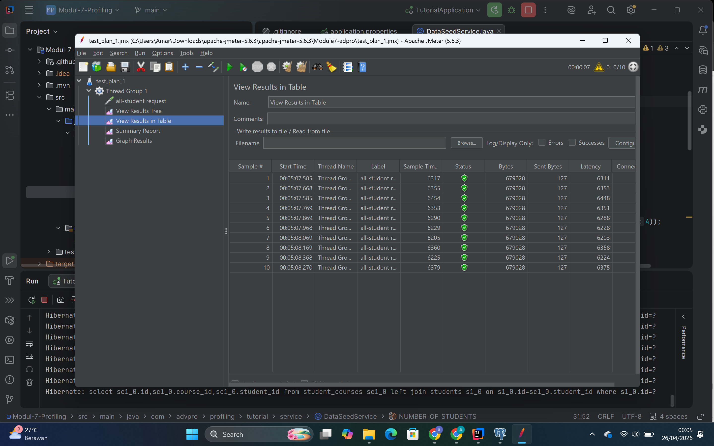
#### 2. CLI
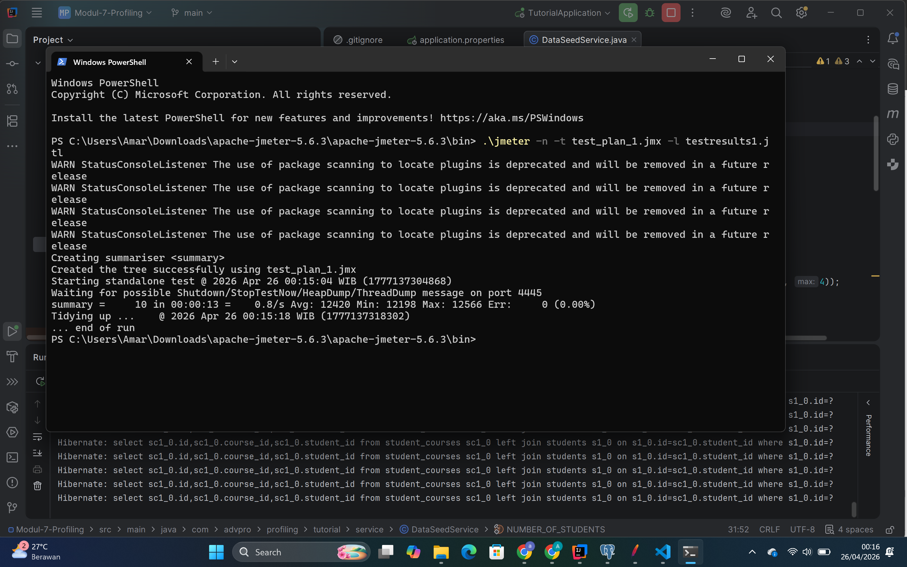

### Endpoint /all-student-name
#### 1. JMeter GUI
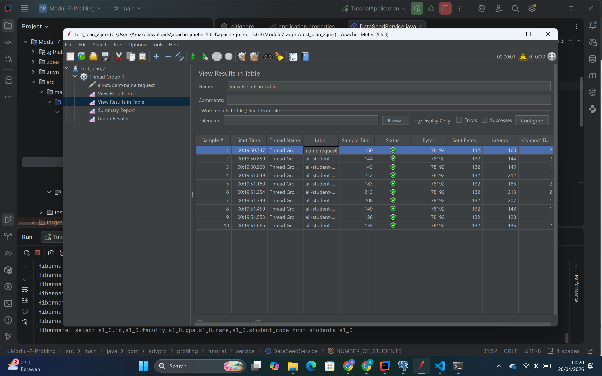
#### 2. CLI


### Endpoint /highest-gpa
#### 1. JMeter GUI
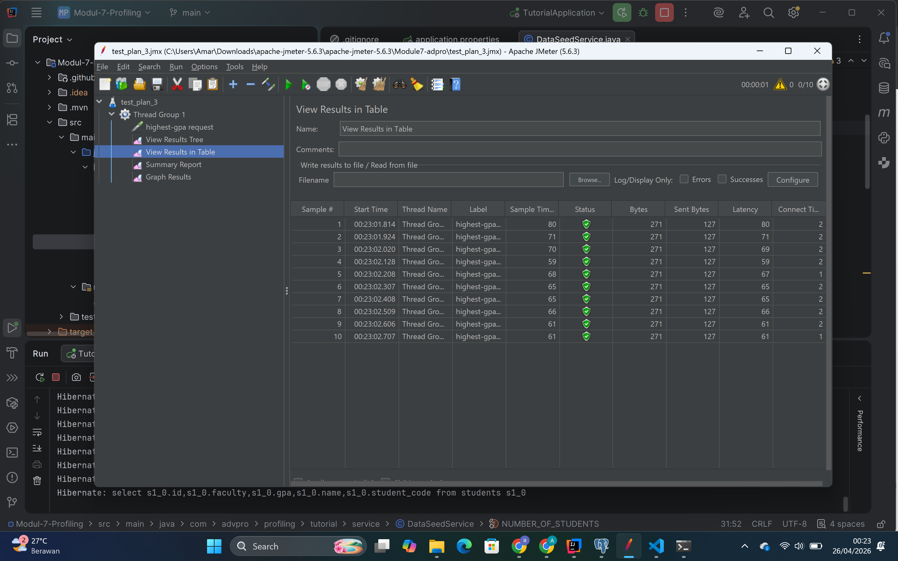
#### 2. CLI
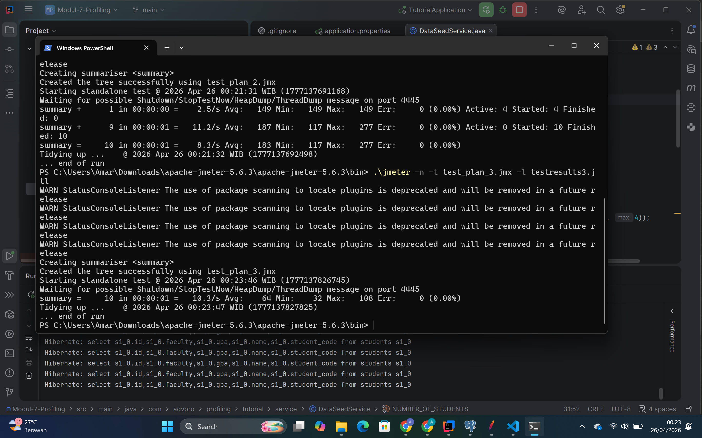

--------------------------------------------------

## Optimization Summary
Setelah melakukan profiling menggunakan IntelliJ Profiler, ditemukan beberapa bottleneck pada aplikasi, terutama:

### 1. `/all-student`
Sebelumnya:
- Mengambil semua student nya gitu
- Loop satu per satu
- Query ke DB di dalam loop (N+1 problem)

Setelah optimasi:
- Menggunakan `JOIN FETCH`
- Semua data diambil dalam 1 query

### Screenshot `/all-student` Optimized
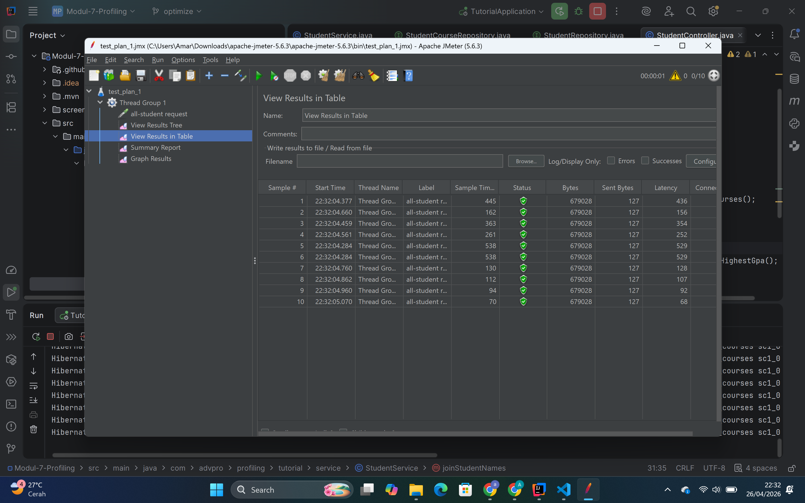

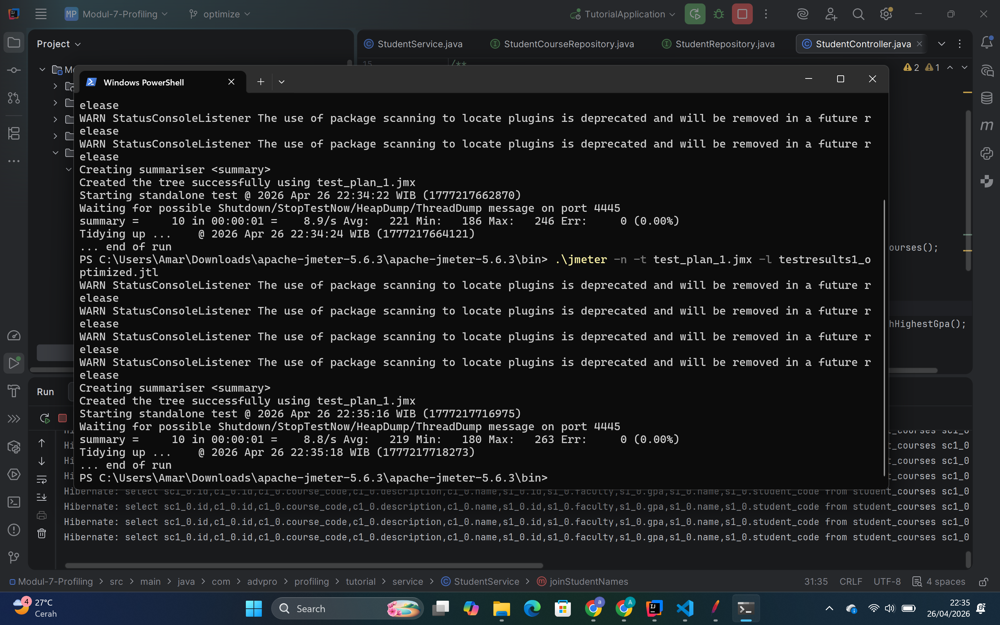

---

### 2. `/all-student-name`
Sebelumnya:
- Menggunakan string concatenation (`+=`)
- Tidak efisien (krn immutable string)

Setelah optimasi:
- Menggunakan `StringBuilder`
- Lebih hemat memory dan lebih cepat

### Screenshot `/all-student-name` Optimized
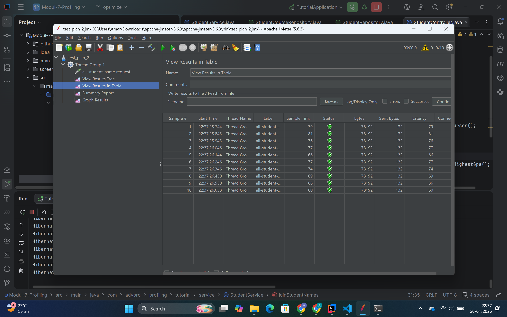

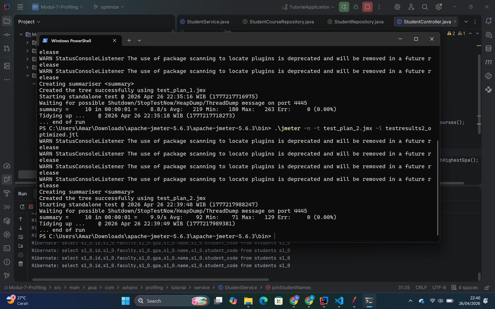

---

### 3. `/highest-gpa`
Sebelumnya:
- Ambil semua student
- Loop manual untuk cari GPA tertinggi

Setelah optimasi:
- Menggunakan query repository:
```java
findTopByOrderByGpaDesc()
```
- Delegasi ke database (lebih optimal)

### Screenshot `/highest-gpa` Optimized
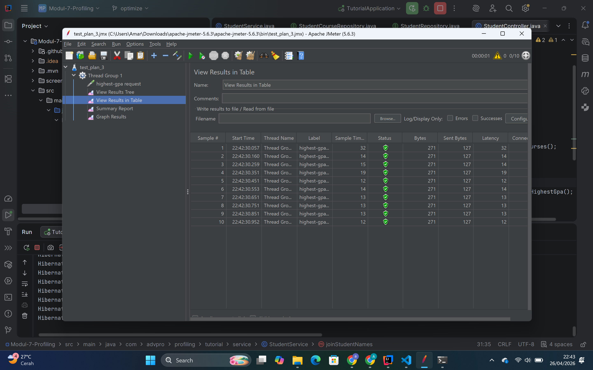

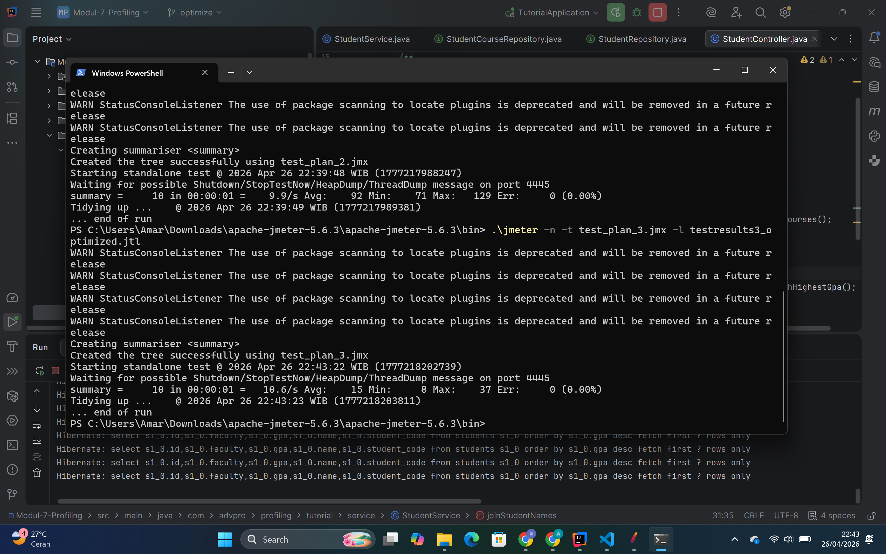

---

## Kesimpulan (Conclusion)
Setelah dilakukan optimasi dan pengujian ulang menggunakan JMeter, terlihat adanya peningkatan performa pada semua endpoint.

Beberapa improvement utamanya:
- Mengurangi jumlah query ke database (mengatasi N+1 problem)
- Menghindari operasi yang tidak efisien di memory (seperti string concatenation berulang)
- Memindahkan proses komputasi ke database (lebih cepat dibanding looping di aplikasi)

Hasil profiling juga menunjukkan penurunan waktu eksekusi yang signifikan, bahkan pada beberapa method mencapai lebih dari 20% improvement.

Dari hasil ini bisa disimpulkan bahwa:
- Optimasi di level query dan struktur kode sangat berpengaruh terhadap performa
- Profiling membantu mengidentifikasi bottleneck secara lebih jelas
- Perubahan kecil seperti penggunaan StringBuilder juga bisa memberikan dampak nyata

---

## Reflection
### 1. Perbedaan JMeter vs IntelliJ Profiler
Menurut aku, JMeter dan IntelliJ Profiler itu punya tujuan yang berbeda:
- JMeter --> fokusnya itu ke performance dari sisi user (response time, throughput)
- Profiler --> fokusnya itu ke dalam code (method mana yang lambat)

Jadi gampangnya itu:
- JMeter kasih tau "ada masalah" gituu
- Profiler kasih tau "masalahnya dimana" gituu

### 2. Bagaimana profiling membantu?
Profiling itu sangat membantu karena:
- Bisa lihat method mana yang paling lama
- Bisa lihat call stack (alur eksekusi)
- Bisa langsung pinpoint bottleneck

Contohnya:
- ketahuan ada loop + query di dalam loop
- langsung keliatan itu sumber masalahnya

### 3. Apakah IntelliJ Profiler efektif?
Menurut aku: YESSSS, sangat efektif

Karena:
- Visual (flame graph gampang dipahamin)
- Bisa langsung connect ke code
- Cepat buat debugging performance issue

### 4. Challenges saat testing & profiling
Beberapa challenge yang aku temui:
- First run hasilnya nggak stabil (karena JIT)
- Kadang susah bedain bottleneck di DB sama yg ada di code

Cara mengatasinya:
- Run beberapa kali (biar stabil)
- Bandingin sebelum & sesudah nya gitu
- Fokus ke method yg paling mahal

### 5. Benefit pakai Profiler
- Bisa tau bottleneck secara spesifik
- Lebih cepat dibanding debug manual
- Bisa lihat impact perubahan secara langsung

### 6. Kalau hasil JMeter & Profiler beda?
Kalau beda:
- Aku cek lagi environment (network, load, dll)
- Fokus ke trend, bukan angka absolut nyaa
- Cross check dengan beberapa run

Karena:
- JMeter = external view
- Profiler = internal view

### 7. Strategy optimasi
Beberapa strategi yang aku pakai:
- Menghindari N+1 query
- Menggunakan query yang lebih optimal
- Mengurangi operasi yang tidak perlu
- Refactoring code supaya lebih efisien

Untuk memastikan tidak merusak functionality:
- Test endpoint setelah perubahan
- Bandingin output sebelum & sesudah
- Pastiin behavior nya itu tetep sama